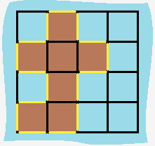

## 463. Island Perimeter
You are given a map in form of a two-dimensional integer grid where 1 represents land and 0 represents water. Grid cells are connected horizontally/vertically (not diagonally). The grid is completely surrounded by water, and there is exactly one island (i.e., one or more connected land cells). The island doesn't have "lakes" (water inside that isn't connected to the water around the island). One cell is a square with side length 1. The grid is rectangular, width and height don't exceed 100. Determine the perimeter of the island.

<strong>Example:</strong>
<pre>
[[0,1,0,0],
 [1,1,1,0],
 [0,1,0,0],
 [1,1,0,0]]
 Answer: 16
Explanation: The perimeter is the 16 yellow stripes in the image below:

</pre>

### Code:
<pre><code>
class Solution {
    public int islandPerimeter(int[][] grid) {
        int len = grid.length;
        int result = 0;
        
        //遍历grid中的所有点，对应为岛的点计算边数加入总的边数
        for (int i = 0; i < len; i++) {
            for (int j = 0; j < grid[0].length; j++) {
                if (grid[i][j] == 1) result += getPerimeter(grid, i, j);
            }
        }
        return result;
    }
    
    //辅助函数，对于每个点算边数
    public int getPerimeter(int[][] grid, int i, int j) {
        int res = 0;
        int[][] neighbour = { {-1, 0}, {1, 0}, {0, -1}, {0, 1} };
        int lenX = grid.length;
        int lenY = grid[0].length;
        for (int k = 0; k < neighbour.length; k++) {
            int dx = neighbour[k][0];
            int dy = neighbour[k][1];
            if (i + dx >= 0 && i + dx < lenX && j + dy >= 0 && j + dy < lenY) {
                if (grid[i + dx][j + dy] == 1) continue;
            }
            res += 1;
        }
        return res;
    }
}
</code></pre>

***
* 该题的解题思路是使用辅助函数getPerimeter来取得每一个值为1的点的周长，周长增加的情况是除了周围的点为1的情况；
* 遍历矩阵中的所有点，如果值为1，则使用getPerimeter计数，返回结果即可。