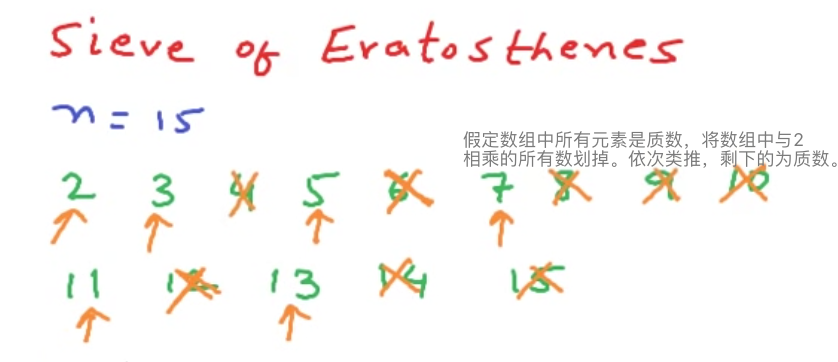

## Count Primes
Count the number of prime numbers less than a non-negative number, n.

### 原始方法（超时）
<pre><code>
class Solution {
    public boolean testPrime(int n) {  //检验质数：用2到sqrt(n)之间的所有整数去除，均无法整除，则n为质数。
        if (n <= 3) {
            return n > 1;
        }
        for (int i = 2; i <= Math.sqrt(n); i++) {
            if (n % i == 0) {
                return false;
            }     
        }
        return true;
    }
    
    public int countPrimes(int n) {
        int cnt = 0;
        for (int i = 2; i < n; i++) {
            if (testPrime(i)) cnt += 1;
        }
        return cnt;
    }
}
</code></pre>

***
* 原始方法的思路是用辅助函数testPrime来检测一个数是否为质数；
* 再使用循环计数。

### 改进方法
<pre><code>
class Solution {
    public int countPrimes(int n) {
        int count = 0;
        boolean[] isPrime = new boolean[n];
        for (int i = 2; i < n; i++) {
            if (isPrime[i] == false) {
                count++;
                for (int j = 2; j * i < n; j++) {
                    isPrime[j*i] = true;
                }
            }
        }
        return count;
    }
}
</code></pre>
***
* 解题思路是使用n长的boolean类型的数组，存储小于n的所有数是质数还是合数。
* 如果是质数则count++，再使用一层循环算出以当前数字为一公因子的合数存入数组。

