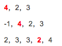

## Non-decreasing Array
Given an array with n integers, your task is to check if it could become non-decreasing by modifying at most 1 element.

We define an array is non-decreasing if array[i] <= array[i + 1] holds for every i (1 <= i < n).

<strong>Example:</strong>
如下图所示，分三种情况： 

## 原始解法：
<pre><code>
class Solution {
    public boolean checkPossibility(int[] nums) {
        int count = 0;  //计数器记录下降的个数
        for (int i = 1; i < nums.length; i++) {
            if (nums[i - 1] > nums[i] && i == 1) { //第一种情况
                nums[i - 1] = nums[i];
                count++;
            } 
            if (nums[i - 1] > nums[i] && nums[i] >= nums[i - 2]) { //第二种情况
                nums[i - 1] = nums[i];
                count++;
            }
            if (nums[i - 1] > nums[i] && nums[i] < nums[i-2]) { //第三种情况
                nums[i] = nums[i - 1];
                count++;
            }
            
        }
        if (count > 1) {
            return false;
        } else {
            return true;
        }
    }
}
</code></pre>

***
* 该题的解题思路是遍历数组，找到不增位，记录个数，如果大于一则返回false。
* 注意在找到不符合条件的位置时，要将该数值修改正确，计数器加一。
* 有三种情况：1.找到下降的位置前一位是首位，直接将前一位修改为下降位的值；2.找到下降位置的上上位大于下降位，则将下降位修改为前一位的值；3.找到下降位的上上位小于等于下降位，则将前一位修改为下降位的值。

## 优化解法：
<pre><code>
class Solution {
    public boolean checkPossibility(int[] nums) {
        int count = 1;
        for (int i = 1; i < nums.length; i++) {
            if (nums[i - 1] > nums[i]) {
                if (count == 0) return false;
                if (i == 1 || nums[i] >= nums[i - 2]) {
                    nums[i - 1] = nums[i];
                } else {
                    nums[i] = nums[i - 1];
                }
                count--;
            }
            
        }
        
        return true;
    }
}</code></pre>

***
* 优化解法的思路和原始解法一样。只是使用了在循环过程中不满足整体条件就直接返回结果，可以节省一部分操作。
* 初始化count计数器原始值为1，表示只有一次修改的时间。如果计数器等于零，则返回，如果遍历结束，则最后返回真。