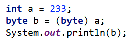

## 一些Java使用中的技巧

### 泛型:
* 泛型是指*“参数化类型”*。参数，在定义方法是有形参，然后调用此方法时传递实参。参数化类型就是将具体类型参数化（类型参数），在使用时传入具体的类型（类型实参）。

	```java
	List< String > list = new ArrayList< String >();
	list.add("abcdefg");
	list.add("helloworld");
	list.add(100); //会出错，因为在定义list变量的时候定义了型参< String > 
	```

***

### 循环数组：

* 可以直接对于数组中的元素进行循环遍历，可以不用重新定义索引来循环数组。
	
	```java
	int[] nums = {1,2,3};
	for (int e : nums) {
		System.out.println(e);
	}
	```
***

### 合并数组：
* 可以使用arraycopy。

	```System.arraycopy(Object src, int srcPos, Object dest, int destPos, int length);```

***
### HashMap与HashSet
* **HashMap的一些使用方法：**
	1. 定义：```HashMap hm = new HashMap();```
	2. 增加操作：```hm.put(a, b);```
	3. 检查是否存在：```hm.containsKey(someKey);```
	4. 删除操作：```hm.remove(someKey);```
	4. ```hm.putIfAbsent(key, value);```如果HashMap中无对应键值，则存入map；如果HashMap中存在相应键值，则返回value值。
	5. ```hm.getOrDefault(key, defaultValue);```如果存在key的映射，则返回value值；如果没有key的映射，则将value赋值为defaultValue。

* **HashSet的一些使用方法：**
	1. 定义：```Set hs = new HashSet< Type >();```
	2. 增加操作：```hs.add(a);```set类中的add方法有返回值，返回值类型为boolean，返回结果为set中是否存在元素。
	3. 检查是否存在：```hs.contains(someKey);```
	4. 删除操作：```hs.remove(someKey);```

***
	
* **定义long型最大和最小值：**Long.MAX_VALUE, Long.MIN_VALUE。

***

### ArrayList
* 是实现List接口的动态数组，即数组的大小可变，相对于传统数组的长度不变。一些方法如下：
	1. ```List arraylist = new ArrayList();     //构造函数```
	2. ```arraylist.add();      //新增元素```
	3. ```arraylist.addAll(Collection <? extends E> c);``` 按照指定collection的迭代器返回元素顺序，将collection中的所有元素添加到此列表的尾部。
	4. ```arraylist.set(int index, E element); ``` 用指定的元素替代此列表中指定位置上的元素。
	5. ```arraylist.remove(int index);```     删除此列表中指定位置上的元素。
	6. ```arraylist.removeRange(int fromIndex, int toIndex);```    移除列表中索引在fromIndex(包括)和toIndex(不包括)之间的所有元素。
	7. ```arraylist.get(int index);``` 查找元素

***
	
### HashMap的遍历：

* 方法一：在for-each循环中使用entries来遍历（在键值都需要使用时）

	```java
	Map< Integer, Integer > map = new HashMap< Integer, Integer >();
		for (Map.Entry< Integer, Integer > entry : map.entrySet()) {
				System.out.println("Key= " + entry.getKey() + ", Value=" + entry.getValue());
		}
	```


* 方法二：在for-each循环中遍历keys或values。(该方法比entrySet遍历在性能上稍好（快了10%），而且代码更加干净)。
	
	```java
	//遍历map中的键
	for (Integer key : map.keySet()) {
			System.out.println("Key = " + key);
	}
	//遍历map中的值
	for (Integer value : map.values()) {
			System.out.println("Value = " + value);
	}
	```


* 方法三：使用Iterator遍历：
	
	```java
	Iterator< Map.Entry < Integer, Integer >> entries = map.entrySet().iterator();
	while (entries.hasNext()) {
			Map.Entry< Integer, Integer > entry = entries.next();
			System.out.println("Key = " + entry.getKey() + ", Value = " + entry.getValue());
	}
	```
	
***

### 排序：
* 对数组进行排序：``` Arrays.sort(int[] nums);```
* <font color = brown>对字符串数组的排序：</font> ```Arrays.sort(String[] string);```对字符串数组排序，得到的结果有如下特点：（1）字符串按照字母表的顺序排列（长词在短词之后）；（2）按照字典顺序（lexicographical ）排列。
* 对集合排序：```Collections.sort(list);```

***

### 复制数组：
* ```int[] temp = nums.clone();```直接在数组对象上使用clone()方法即可。

***

### 遍历数组时需要前后位比较：
 * 当遍历数组的时候，需要使用到前后位比较的情况，如果直接在遍历的过程中查看i+1或者i-1会超出数组索引。因此引用prev或者next变量来记录遍历元素的前后位。

***

### Java基本数据类型转换：
在Java中，整数类型（byte/short/int/long）中，对于未声明数据类型的整形，其默认类型为int型。在浮点类型（float/double）中，对于未声明数据类型的浮点型，默认为double型。</br>

* **隐式类型转化：**隐式转换也叫作自动类型转换, 由系统自动完成。从存储范围小的类型到存储范围大的类型。</br>byte ->short(char)->int->long->float->double
*  **显示类型转换（强制转换）:**</br></br>如上图所示：需要将a赋值给b并且进行强制转化。因为a在此处是变量，而且需要将存储范围大的类型转换为存储范围小的类型，所以需要用到强制转换。


***
### Integer和int的区别:
* int是基本的数据类型；
* Integer是int的封装类；
* int和Integer都可以表示某一个数值；
* int和Integer不能够互用，因为他们两种不同的数据类型； 

	>举个例子：<em>当需要往ArrayList，HashMap中放东西时，像int，double这种内建类型是放不进去的，因为容器都是装object的，这是就需要这些内建类型的外覆类了。</em> Java中每种内建类型都有相应的外覆类。 
	
***
### Stack的一些用法：[Stack API](https://docs.oracle.com/javase/7/docs/api/java/util/Stack.html)
* 堆是一种先进后出的数据结构，用push和pop存储数据。
* ```stack.push(E item);```存入数据；
* ```stack.pop();```取出数据；
* ```stack.empty();```检测堆是否为空，返回boolean类型；
* ```stack.peek();```查看堆顶元素，不取出；
* ```stack.search();```

***
## String
#### StringBuffer & StringBuilder:
* Java.lang.StringBuffer是线程安全的可变字符序列。
* java.lang.StringBuilder是一个与StringBuffer兼容的API，但不保证同步，建议在单线程中使用。
	1. <em>stringbuilder.append('a');
	2. stringbuilder.insert(4, 'a');</em>

#### String类的一些内建函数
* 参考Java API：[String Class API.](https://docs.oracle.com/javase/7/docs/api/java/lang/String.html)
* ```split("ReguExp");```根据正则表达式对字符串进行分割。
* ```	substring(int beginIndex, int endIndex)；```根据开始和结束位置取得子字符串。
* ```toCharArray()；```将字符串转换为char类型的数组。
* ```	trim()；```去掉字符串前端和后端的空白部分。
* ```indexOf(String str);```如果参数字符串是查询字符串的prefix，则返回第一次出现的位置。


***
## Character
#### Character类的一些内建函数
* 参考Java API：[Character Class API.](https://docs.oracle.com/javase/7/docs/api/java/lang/Character.html)
* ```isAlphabetic(int codePoint);```检查一个字符是否为字母。
* ```	isDigit(char ch);```检查是否为数字。
* ```isLetterOrDigit(char ch)```检查是否为字母数字字符。
* ```toLowerCase(char ch)```转换为小写。