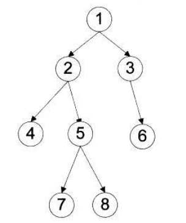

## 刷LeetCode时遇到的一些知识点：

### 如何检测prime number（素数）
	
	> 一般情况下，用2到不大于sqrt(n)的所有整数去除待检验的数，如果均无法整除，则判断为质数。
	<pre><code>
	public boolean isPrime(int n) {
		if (n <= 3) {  //2和3均为质数
			return n > 1;
		}
		for (int i = 2; i < Math.sqrt(n); i++) {
			if (n % i == 0) {
				return false;
			}
		}
		return true;
	}
	</code></pre>

***	
### 字符串中的字符出现次数的题目：
<em>一般情况下使用一个数组表示字符到数组中某一位的映射，然后数组中的每一位存储字符在字符串中的出现次数。</em></br>
	1. 如果题目中给的条件是字符串中都是<strong><em>小写字符(lowercase)</em></strong>：<code>int[] letters = new int[26];</code>
	2. 如果没有限定字符的条件，则为ASCII码，对应的数组即为ASCII码表：<code>int[] freq = new int[]256;</code>

***
### 递归：
* 递归的问题的中心思想是将大问题分解问子问题，通过解决子问题从而解决大问题。
* 递归的函数要包含如下三个方面：<strong>基本条件（函数的结束条件）、递归式（拆分子问题）和返回值。</strong>
* 分析如下使用递归求解阶乘的问题：
	<pre><code>// 递归计算过程
	int factorial(n){
     	if(n == 1) { //基本条件n=1
          return 1;
    	}
     	return n * factorial(n-1);  //返回值和递归式 
	}
	</code></pre>
	
***
### 罗马数字：
<pre>/*罗马数字对应表：
        I   V   X   L   C   D   M
        1   5   10  50  100 500 1000
        规则：
        从左往右，减去极大数之前的数，加上极大数；
        字符串中可能出现多处极大数，都使用上述规则；
        最后一个数总是相加。
        */</pre>

***
### 实现数学加法：
* 在实现加法的方法中，往往使用到carry来记录进位情况；
* 同时遍历两个加数，对于每个加数，值不为空时则加上进位值和当前值；
* 累加和与进制取余数则得到和的当前位，累加和与进制相除则得到进位数。
	<pre><code>List< Integer> res = new ArrayList< Integer>();
	int carry  = 0;
	int i = lenA - 1;
	int j = lenB - 1;
	while (i >= 0 ||j >= 0) {
		int sum = carry;
		if (i >= 0) sum += a[i--];
		if (j >= 0) sum += b[j--];
		res.add(sum % 10);
		carry = sum / 10;
	}
	if (carry != 0) res.add(carry);
	return res.reverse().toArray();
	</code></pre>
	
***
### Newton's Method:
Newton's Method可以用来解决求解平方根的问题。

* 迭代公式为：X(k+1) = 1/2 * (X(k) + (n / X(k)))。

***
### 二分法:
二分法比较详细的讲解如下：[二分法](http://blog.csdn.net/jacob_007/article/details/52601847)

* 二分查找
	
	1. 循环终止条件为start+1 < end，其中start=0，end=len-1。
	2. mid = (start + end) >>> 1。
	3. 如果data[mid]满足条件，直接返回；如果满足条件的数据在data[mid]的右边，则start=mid；如果满足条件的数据在data[mid]的左边，则end=mid。
	4. 循环结束后，根据条件再次判断start和end的情况是否满足。
	
	```java
	public int binarySearch(int[] a, int b) {
		int start = 0, end = a.length - 1;
		//循环找到目标范围左右的两个索引
		while (start + 1 < end) {
			int mid = (start + end) >>> 1;
			if (a[mid] == b) return mid;
			else if (a[mid] < b) start = mid;
			else end = mid;
		}
		
		//分析索引两边的情况，输出结果
		if (a[end] == b) return end;
		else if (a[start] == b) return start;
		else return -1;
	}
	```

***
### 回溯法（backtracking）
回溯可以参考如下博客内容：[CSDN Backtracking](http://blog.csdn.net/cyfcsd/article/details/50432265)</br>
回溯法的中心思想是：**走不通，退回再走**，它是一种试探性算法，通常意义上来讲，回溯法是进行有组织的穷举，在试探过程中不断通过题设要求减少搜索空间。

回溯法的搜索策略主要分为两步：构建**状态空间树**和**搜索**。

* 状态空间树就是在每一步选择中有多少可选值，比如第一步有8个可选值，则树的第一层就有8个节点，第二步有5个可选值，则第一层每个节点都有5个分支，表示为第二层有40个节点。
* 在搜索的过程中构造一个维数和树层数n-1相等的解向量solution，每个分量r对应每一步选择的结果。
	* r=n-1，说明得到问题的一个可行解；
	* 某一层的候选值选完仍然没有可行解，则退回r--进行选择；
	* 如果r--的过程中小于0，则说明搜索完了整棵树，没有可行解。

**模板代码**

```java
public backtrack() {
	initial(x); //初始化解向量
	i = 0; k[i] = 1; flag = false; //初始化
	while (i >= 0) {  //循环条件行数大于0
		while (k[i] < m[i]) {
			x[i] = get(i, k[i]); //得到选择元素
			if (constrain(x) && bound(x)) { //是可行解
				if (solution(x)) { //是最终解
					flag = true; break;
				}
				else { //不是最终解
					i = i+1; k[i] = 0;
				}
			} else { //不是可行解
				k[i] = k[i] + 1;
				}
			}
			if (flag) break;
			k[i] = 1; i = i-1; k[i] = k[i] + 1; //回溯
		}
	if (!flag) { // 无解
		initial{x}; //重置解向量
	}	
}
```
**代码解释**

初始化解向量，用i表示当前行数，k[i]表示选第i行的第几个值，flag是一个标志位，用来退出循环。

最外层循环体使用i控制搜索树的深度，内层循环体控制树的每一行搜索，m[i]为第i-1行中每棵树的分枝数。k[i]<m[i]控制循环在当前层中的每个节点中搜索。此时应该注意每一行搜索完了要进行恢复现场和上一行元素的后移位。

> get函数用来将位置信息转化为真正的信息。然后判断是否为部分可行解。一要看是否满足约束条件，二是看是否满足上下界条件。如果不是可行解，则搜索当前层下一个元素，k[i]=k[i]+1.如果是部分可行解，则继续判断是否为最终可行解，如果是结束算法。如果不是保存当前选择，继续搜索下一行。

### 递归法解回溯问题
* 弄明白递归的终止条件是什么，比如解空间为空，即找到可行解。
* 在状态空间树的每一层，对每一个可选值使用递归，并且写出下一层的状态空间树。
* 递归时传入下一层的初始状态和状态空间树。

***
### 排序(sort)
可以参考[排序笔记](https://github.com/ShawnNew/myLeetcodeAnswer/blob/master/Notes/%E6%8E%92%E5%BA%8F.md)

***
### 二叉树
二叉树是一种非常重要的数据结构，有深度遍历和广度遍历两种方法遍历二叉树。深度遍历有前序、中序以及后序三种遍历方法；广度遍历即通常所说的层次遍历。四种基本遍历思想如下：

1. 前序遍历：根结点--->左子树--->右子树
2. 中序遍历：左子树--->根节点--->右子树
3. 后序遍历：左子树--->右子树--->根结点
4. 层次遍历：仅仅需按层次遍历就可以

对如下的二叉树，各种遍历有：



* 前序遍历：1-2-4-5-7-8-3-6
* 中序遍历：4-2-7-5-8-1-3-6
* 后序遍历：4-7-8-5-2-6-3-1
* 层次遍历：1-2-3-4-5-6-7-8

### 前序遍历代码如下：
递归解法：

```java
public void preOrderTraverse1 (TreeNode root) {
	if (root != null) {
		System.out.print(root.val+" ");
		preOrderTraverse1(root.left);
		preOrderTraverse1(root.right);
	}
}
```
非递归解法：需要使用栈来辅助。

a）首先，把结点node入栈，当前结点置为做孩子；

b）推断结点node是否为空，若为空。则取出栈顶结点并出栈，将右孩子置位当前结点；否则反复a）步直到当前结点为空或者栈为空（能够发现栈中的几点就是为了访问右孩子才存储的）

```java
public void preOrderTraverse2 (TreeNode root) {
	LinkedList<TreeNode> stack = new LinkedList<>();
	TreeNode pNode = root;
	while (pNode != null || !stack.isEmpty()) {
		if (pNode != null) {
			System.out.print(pNode.val+" ");
			stack.push(pNode);
			pNode = pNode.left;
		} else {  // pNode == null && !stack.isEmpty()
			TreeNode node = stack.pop();
			pNode = node.right;
			
		}
	}
}
```

### 中序遍历如下
递归解法

```java
public void inOrderTraverse1 (TreeNode root) {
	if (root != null) {
		inOrderTraverse1(root.left);
		System.out.print(root.val+" ");
		inOrderTraverse1(root.right);
	}
}
```

非递归解法

```java
public void inOrderTraverse2 (TreeNode root) {
	LindedList<TreeNode> stack = new LinkedList<>();
	TreeNode pNode = root;
	while (pNode != null || !stack.isEmpty()) {
		if (pNode !=  null) {
			stack.push(pNode);
			pNode = pNode.left;
		} else {    // pNode == null && !stack.isEmpty()
			TreeNode node = stack.pop();
			System.out.print(node.val+ " ");
			pNode = node.right;
		}
	}
}
```

### 后序遍历

递归实现

```java
public void postOrderTraverse1(TreeNode root) {  
        if (root != null) {  
            postOrderTraverse1(root.left);  
            postOrderTraverse1(root.right);  
            System.out.print(root.val+"  ");  
        }  
    }  
```

后序遍历的非递归实现是三种遍历方式中最难的一种。由于在后序遍历中，要保证左孩子和右孩子都已被訪问而且左孩子在右孩子前訪问才干訪问根结点，这就为流程的控制带来了难题。

因此使用一个中间栈来存储逆后序遍历的结果，即中间栈存储顺序：根结点--->右子树--->左子树。然后再依次pop出中间栈中的元素即可。

```java
public void postOrderTraverse2(TreeNode root) {
	Stack<TreeNode> stack = new Stack<>();
	Stack<TreeNode> output = new Stack<>();
	TreeNode pNode = root;
	while (pNode != null || !stack.isEmpty()) {
		if (pNode != null) {
			output.push(pNode);
			stack.push(pNode);
			pNode = pNode.right;
		} else {
			pNode = stack.pop();
			pNode = pNode.left;
		}
	}
	while (!output.isEmpty()) {
		TreeNode node = output.pop();
		System.out.print(node.val+ " ");
	}
}
```