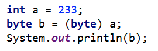

## 一些Java使用中的技巧

* <strong>泛型：</strong><p>泛型是指<em>“参数化类型”</em>。参数，在定义方法是有形参，然后调用此方法时传递实参。参数化类型就是将具体类型参数化（类型参数），在使用时传入具体的类型（类型实参）。
```java
List< String > list = new ArrayList< String >();
list.add("abcdefg");
list.add("helloworld");
list.add(100); //会出错，因为在定义list变量的时候定义了型参< String > 
```

***

* <strong>循环数组：</strong>可以直接对于数组中的元素进行循环遍历，可以不用重新定义索引来循环数组。

```java
int[] nums = {1,2,3};
for (int e : nums) {
	System.out.println(e);
}
```

***

* <strong>合并数组：</strong>可以使用arraycopy。
```java
System.arraycopy(Object src, int srcPos, Object dest, int destPos, int length);
```

***

* <strong>HashMap的一些使用方法：</strong>
	1. 定义：```HashMap hm = new HashMap();```
	2. 增加操作：```hm.put(a, b);```
	3. 检查是否存在：```hm.containsKey(someKey);```
	4. 删除操作：```hm.remove(someKey);```
	4. ```hm.putIfAbsent(key, value);```如果HashMap中无对应键值，则存入map；如果HashMap中存在相应键值，则返回value值。
	5. ```hm.getOrDefault(key, defaultValue);```如果存在key的映射，则返回value值；如果没有key的映射，则将value赋值为defaultValue。

* <strong>HashSet的一些使用方法：</strong>
	1. 定义：```Set hs = new HashSet< Type >();```
	2. 增加操作：```hs.add(a);```set类中的add方法有返回值，返回值类型为boolean，返回结果为set中是否存在元素。
	3. 检查是否存在：```hs.contains(someKey);```
	4. 删除操作：```hs.remove(someKey);```

***
	
* <strong>定义long型最大和最小值：</strong>Long.MAX_VALUE, Long.MIN_VALUE。

***

* <strong>ArrayList</strong>是实现List接口的动态数组，即数组的大小可变，相对于传统数组的长度不变。一些方法如下：
	1. List arraylist = new ArrayList();     //构造函数
	2. arraylist.add();      //新增元素
	3. arraylist.addAll(Collection <? extends E> c); //按照指定collection的迭代器返回元素顺序，将collection中的所有元素添加到此列表的尾部。
	4. arraylist.set(int index, E element);   //用指定的元素替代此列表中指定位置上的元素。
	5. arraylist.remove(int index);     //删除此列表中指定位置上的元素。
	6. arraylist.removeRange(int fromIndex, int toIndex);    //移除列表中索引在fromIndex(包括)和toIndex(不包括)之间的所有元素。
	7. arraylist.get(int index); //查找元素

***
	
* <strong>HashMap的遍历：</strong>
	1. 方法一：在for-each循环中使用entries来遍历（在键值都需要使用时）
	```java
	Map< Integer, Integer > map = new HashMap< Integer, Integer >();
	for (Map.Entry< Integer, Integer > entry : map.entrySet()) {
			System.out.println("Key= " + entry.getKey() + ", Value=" + entry.getValue());
	}
	```
	2. 方法二：在for-each循环中遍历keys或values。(该方法比entrySet遍历在性能上稍好（快了10%），而且代码更加干净)。
	```java
	//遍历map中的键
	for (Integer key : map.keySet()) {
			System.out.println("Key = " + key);
	}
	//遍历map中的值
	for (Integer value : map.values()) {
			System.out.println("Value = " + value);
	}
	```
	3. 方法三：使用Iterator遍历：
	```java
	Iterator< Map.Entry < Integer, Integer >> entries = map.entrySet().iterator();
	while (entries.hasNext()) {
			Map.Entry< Integer, Integer > entry = entries.next();
			System.out.println("Key = " + entry.getKey() + ", Value = " + entry.getValue());
	}
	```
	
***
* <strong>排序：</strong>
	1. 对数组进行排序：```<em>Arrays.sort(int[] nums);</em>```
		* <font color = brown>对字符串数组的排序：</font>```<em>Arrays.sort(String[] string);</em>```对字符串数组排序，得到的结果有如下特点：（1）字符串按照字母表的顺序排列（长词在短词之后）；（2）按照字典顺序（lexicographical ）排列。
	2. 对集合排序：```<em>Collections.sort(list);</em>```

***
* <strong>复制数组：</strong>```<em>int[] temp = nums.clone();</em>```直接在数组对象上使用clone()方法即可。

***

* <strong>遍历数组时需要前后位比较：</strong>当遍历数组的时候，需要使用到前后位比较的情况，如果直接在遍历的过程中查看i+1或者i-1会超出数组索引。因此引用prev或者next变量来记录遍历元素的前后位。

***
* <strong>Java基本数据类型转换：</strong></br>
在Java中，整数类型（byte/short/int/long）中，对于未声明数据类型的整形，其默认类型为int型。在浮点类型（float/double）中，对于未声明数据类型的浮点型，默认为double型。</br>

	1. <strong>隐式类型转化：</strong>隐式转换也叫作自动类型转换, 由系统自动完成。从存储范围小的类型到存储范围大的类型。</br>byte ->short(char)->int->long->float->double
	2. <strong>显示类型转换（强制转换）:</strong></br></br>如上图所示：需要将a赋值给b并且进行强制转化。因为a在此处是变量，而且需要将存储范围大的类型转换为存储范围小的类型，所以需要用到强制转换。

***
* <strong>字符串的分割：</strong>java中String有自带函数```<em>split("ReguExp");</em>```其作用是匹配正则表达式ReguExp并且将字符串分割。

***
* <strong>Integer和int的区别:</strong>
	1. int是基本的数据类型；
	2. Integer是int的封装类；
	3. int和Integer都可以表示某一个数值；
	4. int和Integer不能够互用，因为他们两种不同的数据类型； 

	>举个例子：<em>当需要往ArrayList，HashMap中放东西时，像int，double这种内建类型是放不进去的，因为容器都是装object的，这是就需要这些内建类型的外覆类了。</em> Java中每种内建类型都有相应的外覆类。 
	
***
#### Stack的一些用法：
* 堆是一种先进后出的数据结构，用push和pop存储数据。
* ```stack.push(E item);```存入数据；
* ```stack.pop();```取出数据；
* ```stack.empty();```检测堆是否为空，返回boolean类型；
* ```stack.peek();```查看堆顶元素，不取出；
* ```stack.search();```

***
#### StringBuffer & StringBuilder:
* Java.lang.StringBuffer是线程安全的可变字符序列。
* java.lang.StringBuilder是一个与StringBuffer兼容的API，但不保证同步，建议在单线程中使用。
	1. <em>stringbuilder.append('a');
	2. stringbuilder.insert(4, 'a');</em>
