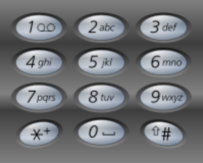

## 17. Letter Combinations of a Phone Number

Given a digit string, return all possible letter combinations that the number could represent.

A mapping of digit to letters (just like on the telephone buttons) is given below.



```
Input:Digit string "23"
Output: ["ad", "ae", "af", "bd", "be", "bf", "cd", "ce", "cf"].
```
**Note:**
Although the above answer is in lexicographical order, your answer could be in any order you want.

### Code:

```java
class Solution {
    public List<String> letterCombinations(String digits) {
        List<String> result = new LinkedList<String>();
        String[] digitToLetters = {"", "", "abc", "def", "ghi", "jkl", "mno", "pqrs", "tuv", "wxyz"};
        if (digits.length() == 0) return result;
        result.add("");
        for (int i = 0; i < digits.length(); i++) {
            result = combine(result, digitToLetters[Character.getNumericValue(digits.charAt(i))]);
        }
        return result;
    }
    
    //combine函数，将传入字符串prev与数字对应的所有char拼接并返回
    public List<String> combine(List<String> prev, String letters) {
        List<String> res = new LinkedList<String>();
        for (String x : prev) {
            for (int i = 0; i < letters.length(); i++) {
                res.add(x + letters.charAt(i));
            }
        }
        return res;
    }
}
```

### 解题思路
* 使用combine函数作为辅助，combine函数的作用是把字符串与数字对应的所有字符拼接后返回字符串数组；
* 在主函数中遍历按键字符串分别加入对应字符即可。