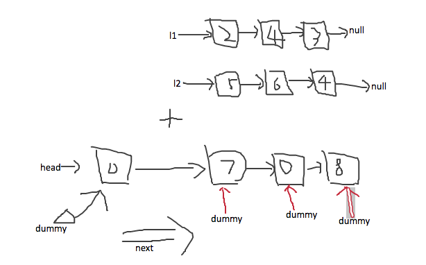

##2. Add Two Numbers
You are given two non-empty linked lists representing two non-negative integers. The digits are stored in reverse order and each of their nodes contain a single digit. Add the two numbers and return it as a linked list.

You may assume the two numbers do not contain any leading zero, except the number 0 itself.

**Example**

```java
Input: (2 -> 4 -> 3) + (5 -> 6 -> 4)
Output: 7 -> 0 -> 8
Explanation: 342 + 465 = 807.
```

#### Code:
```java
/**
 * Definition for singly-linked list.
 * public class ListNode {
 *     int val;
 *     ListNode next;
 *     ListNode(int x) { val = x; }
 * }
 */
class Solution {
    public ListNode addTwoNumbers(ListNode l1, ListNode l2) {
        ListNode head = new ListNode(0);
        ListNode dummy = head; //dummy node指向结果链表的头
        int carry = 0;
        while (l1 != null || l2 != null) {
            int sum = carry;
            if (l1 != null) {
                sum += l1.val;
                l1 = l1.next;
            }
            if (l2 != null) {
                sum += l2.val;
                l2 = l2.next;
            }
            dummy.next = new ListNode(sum % 10); //dumynode的下一结点记录和
            carry = sum / 10;
            dummy = dummy.next;  //移动dummynode到next
        }
        if (carry != 0) {
            dummy.next = new ListNode(carry);
        } 
        
        return head.next;
    }
}
```

***
#### 解题思路：
* 使用dummy node，可以保证返回链表的head不动；
* 将求得的和存入dummy.next；
* 因为head结点定义时初始化为0，因此返回head.next即为所求的和。
	