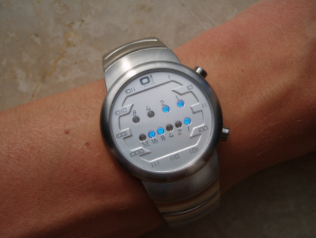

## 401. Binary Watch

A binary watch has 4 LEDs on the top which represent the hours (0-11), and the 6 LEDs on the bottom represent the minutes (0-59).

Each LED represents a zero or one, with the least significant bit on the right.



For example, the above binary watch reads "3:25".

Given a non-negative integer n which represents the number of LEDs that are currently on, return all possible times the watch could represent.

**Example:**

```
Input: n = 1
Return: ["1:00", "2:00", "4:00", "8:00", "0:01", "0:02", "0:04", "0:08", "0:16", "0:32"]
```
**Note:**

* The order of output does not matter.
* The hour must not contain a leading zero, for example "01:00" is not valid, it should be "1:00".
* The minute must be consist of two digits and may contain a leading zero, for example "10:2" is not valid, it should be "10:02".

### Code:

```java
class Solution {
    public List<String> readBinaryWatch(int num) {
        List<String> result = new ArrayList<String>();
        
        for (int i = 0 ; i < 12; i++) {
            for (int j = 0; j < 60; j++) {
                if (Integer.bitCount(i) + Integer.bitCount(j) == num) {
                    result.add(i + ":" + (j < 10 ? ("0"+j) : j));
                }
            }
        }
        return result;
    }
}
```

### 解题思路
* 遍历表上的所有12小时与60分钟组合时间的时间，判断每一个时间的bitCount相加是否为num；
* 如果```Integer.bitCount(i) + Integer.bitCount(j) == num```则将该时间加入结果中。