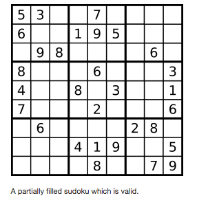

## 36. Valid Sudoku


Determine if a Sudoku is valid, and the rule of Sudoku is as followed:

1. Each row must have the numbers 1-9 occuring just once.
2. Each column must have the numbers 1-9 occuring just once.
3. And the numbers 1-9 must occur just once in each of the 9 sub-boxes of the grid.

The Sudoku board could be partially filled, where empty cells are filled with the character '.'.



**Note:**

A valid Sudoku board (partially filled) is not necessarily solvable. Only the filled cells need to be validated.


### Code

```java
class Solution {
    public boolean isValidSudoku(char[][] board) {
        for (int i = 0; i < 9; i++) {
            Set<Character> row = new HashSet<Character>();
            Set<Character> col = new HashSet<Character>();
            Set<Character> cube = new HashSet<Character>();
            for (int j = 0; j < 9; j++) {
                if (board[i][j] != '.' && !row.add(board[i][j])) return false;
                if (board[j][i] != '.' && !col.add(board[j][i])) return false;
                int rowIndex = 3 * (i/3);
                int colIndex = 3 * (i%3);
                if (board[rowIndex + j/3][colIndex + j%3] != '.' && !cube.add(board[rowIndex + j/3][colIndex + j%3]))
                    return false;
            }
        }
        return true;
    }
}
```

### 解题思路

* 根据题目要求，使用HashSet存储每一个行、列和subgrid中的元素，要求每一个HashSet不能重复；
* 在遍历数组的时候，正序i、j可以得到每一行的遍历，逆序j、i可以得到每一列的遍历；
* ```rowIndex=3*(i/3)+j/3```和```colIndex=3*(i%3)+j%3```可以得到每个小区域的遍历。