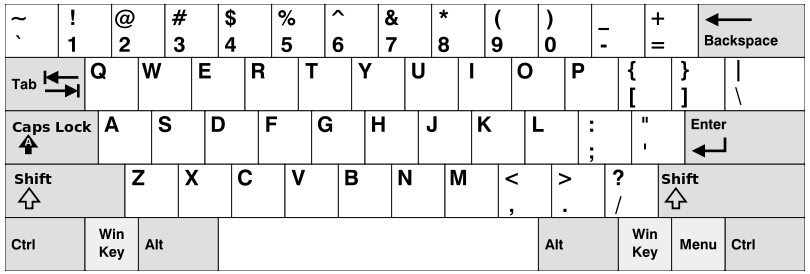

## 500. Keyboard Row
Given a List of words, return the words that can be typed using letters of alphabet on only one row's of American keyboard like the image below.

<strong>Example 1:</strong>
Input: ["Hello", "Alaska", "Dad", "Peace"]
Output: ["Alaska", "Dad"]

### Code:
<pre><code>
class Solution {
    public String[] findWords(String[] words) {
        List<String> result = new ArrayList<String>();
        String[] rowRecord = {"QWERTYUIOP","ASDFGHJKL", "ZXCVBNM"};
        Map<Character, Integer> map = new HashMap<Character, Integer>();
        for (int i = 0; i < rowRecord.length; i++) {
            for (char c : rowRecord[i].toCharArray()) {
                map.put(c, i);
            }
        }
        for (String word : words) {
            int temp = map.get(word.toUpperCase().charAt(0));
            for (char c : word.toUpperCase().toCharArray()) {
                if (map.get(c) != temp) {
                    temp = -1;
                    break;
                }
            }
            if (temp != -1) result.add(word);
        }
        
        String[] res = new String[result.size()];
        for (int i = 0; i < result.size(); i++) {
            res[i] = result.get(i);
        }
        return res;
    }
}
</code></pre>

***
* 注意要用大写字母
* 将字母和行数存入HashMap；
* 遍历字符串数组，如果有不在同一行的字符，则不写入结果。