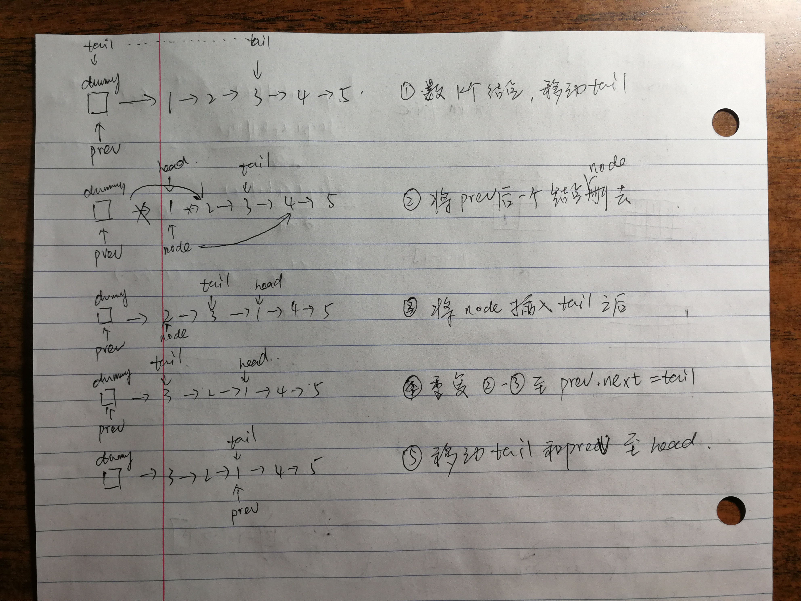

## 25. Reverse Nodes in k-Group

Given a linked list, reverse the nodes of a linked list k at a time and return its modified list.

k is a positive integer and is less than or equal to the length of the linked list. If the number of nodes is not a multiple of k then left-out nodes in the end should remain as it is.

You may not alter the values in the nodes, only nodes itself may be changed.

Only constant memory is allowed.

For example,
Given this linked list: 1->2->3->4->5

For k = 2, you should return: 2->1->4->3->5

For k = 3, you should return: 3->2->1->4->5

### Code

```java
/**
 * Definition for singly-linked list.
 * public class ListNode {
 *     int val;
 *     ListNode next;
 *     ListNode(int x) { val = x; }
 * }
 */
class Solution {
    public ListNode reverseKGroup(ListNode head, int k) {
        if (head == null || head.next == null || k < 2) return head;
        
        ListNode dummy = new ListNode(0);
        dummy.next = head;
        ListNode prev = dummy, node;
        ListNode tail = dummy;
        int count = 0;
        
        while (true) {
            // count the valid sub-list to reverse
            count = 0;
            while (count < k && tail != null) {
                count++;
                tail = tail.next;
            }
            
            if (tail == null) break;  // less than k nodes, break
            
            // reverse
            head = prev.next;   // the head node of the sub-list
            while (prev.next != tail) { // reverse using prev & nextNode
                node = prev.next;   // assign node
                prev.next = node.next;  // delete node
                node.next = tail.next;
                tail.next = node;
            }
            
            tail = head;
            prev = head;
        }
        return dummy.next;
    }
} 
```

### 解题思路



* 如示意图所示，使用dummy来记录链表的头部（因为在算法进行的过程中，链表的头结点发生了改变）；
* 维护prev和tail两个结点变量，分别指向需要翻转的子段的头部的前一个结点和尾部；
* 算法分为五小步：
	* 首先遍历k遍链表，找到需要翻转的子链表的尾部结点；
	* 然后定位子链表的head结点（prev的下一结点），并且分配prev.next为node，node结点是我们要处理的结点，需要将其从链表中删除；
	* 将node结点插入tail结点之后；
	* 重复上面的2-3步，知道```prev.next == tail```；
	* 最后一栋tail和prev结点至head结点，再从第一步开始进行。