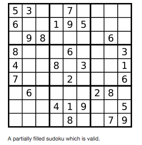
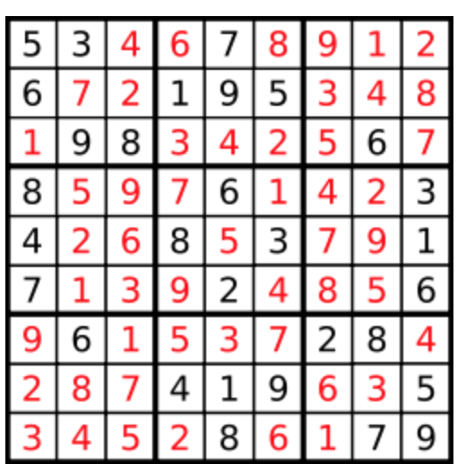

## 37. Sudoku Solver

Write a program to solve a Sudoku puzzle by filling the empty cells.

Empty cells are indicated by the character '.'.

You may assume that there will be only one unique solution.



The solution is:


### Code

```java
class Solution {
    public void solveSudoku(char[][] board) {
        if (board == null || board.length == 0) return;
        doSolve(board, 0, 0);
    }
    
    public boolean doSolve(char[][] board, int row, int col) {
        /*
        Solve the problem using backtracking, do it recursively.
        Input:
            board : the board matrix
            row   : start row
            col   : start col
        Output:
            a boolean value specifiy whether the problem is solved
        */
        for (int i = row; i < 9; i++, col=0) {
            for (int j = col; j < 9; j++) {
                if (board[i][j] == '.') {
                    for (char num = '1'; num <= '9'; num++) { //解空间，从1到9的数
                        if (isValid(board, i, j, num)) {
                            board[i][j] = num;      //依次尝试解空间
                            if (doSolve(board, i, j+1)) return true; //递归找到最优解
                            else board[i][j] = '.';    //回溯
                        }
                    } 
                    //解空间遍历结束，未找到最优解
                    return false;
                }
            }
        }
        return true;
    }
    
    public boolean isValid(char[][] board, int row, int col, char c) {
        //检查在矩阵的某一位加一个元素之后是否有效
        int rowIndex = 3 * (row/3)， colIndex = 3 * (col/3); //在3*3的块中行列的索引
        for (int i = 0; i < 9; i++) {
            if (board[row][i] == c) return false;  //检查当前行
            if (board[i][col] == c) return false;  //检查当前列
            if (board[rowIndex+i/3][colIndex+i%3] == c) return false;  //检查3*3的块
        }
        return true;
    }
}
```

### 解题思路

* 使用回溯法解题，思路如下
	
	```java
	public void main(char[][] board){
		doSolve(board, 0, 0)  // 调用doSolve递归解题
	}
	
	public boolean doSolve(char[][] board, int row, int col) {
		isValid(board, i, j, num) // 尝试解空间的一个元素，检查是否有效
			board[i][j] = num;   // 尝试num
			doSolve(board, i, j+1)  // 递归求得最优解
				 return true
			board[i][j] = '.'  // 回溯
	}
	
	public boolean isValid(char[][] board, int row, int col, char c) {
		int rowIndex = 3*(row/3)
		int colIndex = 3*(col/3)
		for (i = 0 : 9) {
			//check row
			//check col
			//check block	
		}
		return true;
	}
	```
* 递归时，尝试从‘1’到‘9’的所有元素，检查是否有效，然后放入之后调用递归，递归结束回溯。
