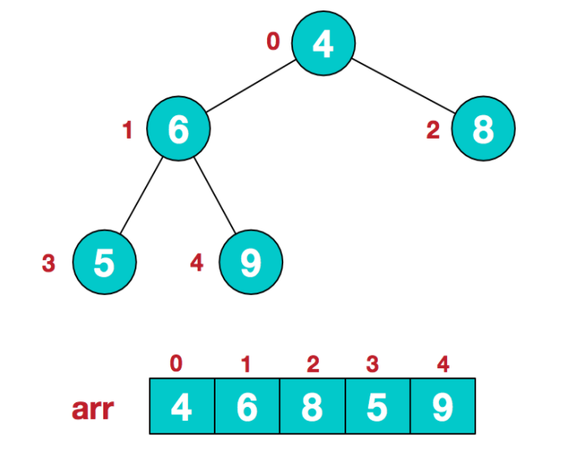
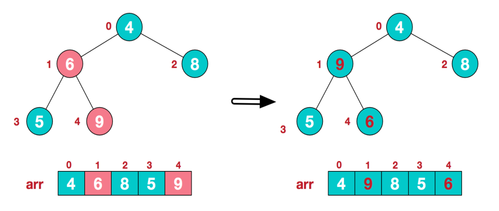
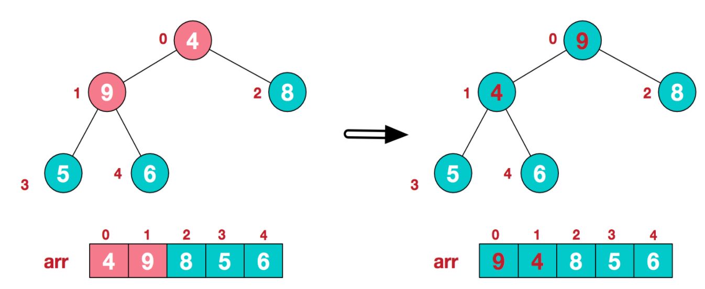
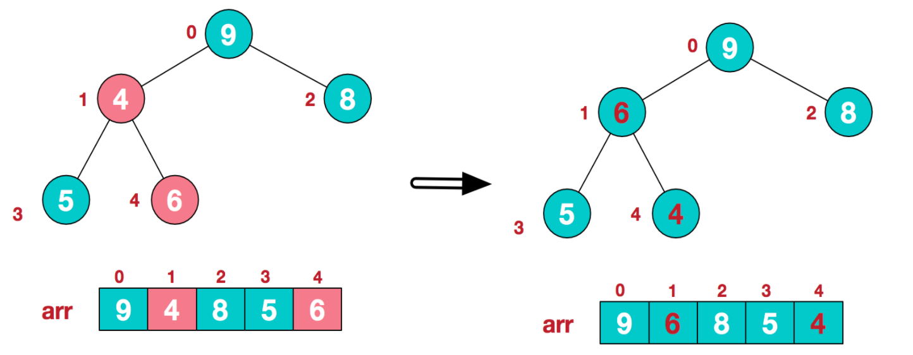
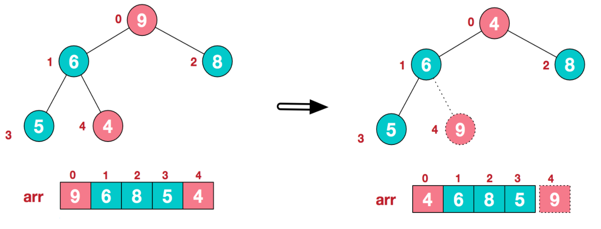
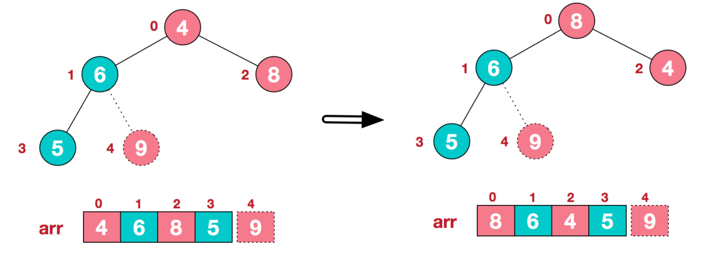
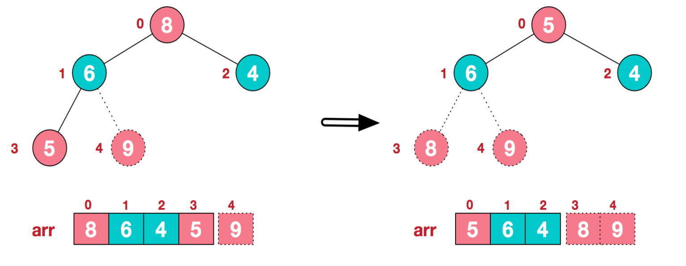
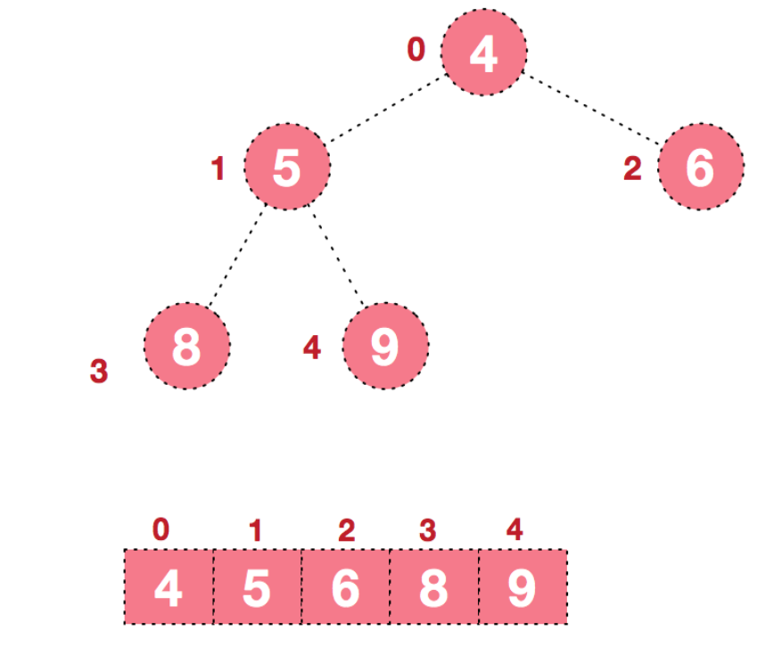

# 排序
排序通常是指内部排序算法，即数据记录在内存中进行排序。大致可分为以下两种类型：

* 比较排序，时间复杂度为O(nlogn)~O(n^2)，主要包括：冒泡排序，选择排序， 插入排序，归并排序，堆排序，快速排序等。
* 非比较排序，时间复杂度可以达到O(n)，只要包括：计数排序，基数排序，桶排序等。

排序算法的稳定性，是通过算法排序过后，原数组中的相同值元素的相对位置是否发生改变判断。排序算法的稳定性具有相对性，即在某些情况下，稳定与不稳定可以相互转换。

在Java的底层代码中，对于基础类的排序使用不稳定的快速排序，因为对于基础类不用考虑相同值的元素的位置差别，只需使用速度最快的排序即可；然而非基础类（Collections类）需要使用稳定的归并排序，因为费基础类的元素的相对位置不宜改变。

## 冒泡排序
冒泡排序的思想每次比较相邻元素，然后交换两元素的顺序，每遍历一遍数组，则最大元素会像气泡一样到达顶端；一直进行上述操作，直到所有元素都按顺序排列。最差时间复杂度为O(n^2)，平均时间复杂度为O(n^2)。

模板代码如下，算法包括两个方法：swap和bubbleSort

```java
public void swap(int[] nums, int i, int j) {
	int temp = nums[i];
	nums[i] = nums[j];
	nums[j] = temp;
}

public void bubbleSort(int[] nums, int n) {
	for (int i = 0; i < n-1; i++) {
		for (int j = 0; j < n-i-1; j++) {  //注意已经排好的元素要忽略
			if (nums[j] > nums[j+1]) swap(nums, j, j+1);
		}
	}
}

public void main (int[] nums) {
	int len = nums.length;
	bubbleSort(nums, len);
}
```

## 选择排序
选择排序的思路是，开始选择最小元素，放到数组的首端；然后依次找到较小元素，放到已排序数组的最后，依次类推，直到所有元素均排序完毕。

模板代码如下，算法包括两个方法：swap和selectSort

```java
public void swap(int[] nums, int i, int j) {   //交换两个元素
        int temp = nums[i];
        nums[i] = nums[j];
        nums[j] = temp;
    }
    
    public void selectSort(int[] nums, int n) {
        for (int i = 0; i < n-1; i++) {
            int min = nums[i];
            for (int j = i+1; j < n; j++) {
                if (nums[j] < min) {
                    min = nums[j];
                    swap(nums, j, i);
                }
            }
        }
    }
```

## 插入排序
插入排序的思想是对于未排序数据，在已排序序列中从后向前扫描，找到相应位置并插入。

具体实现方法如下：


1. 从第一个元素开始，该元素可以认为已经被排序
* 去除下一个元素，从后向前扫描已经排好序的元素
* 如果该元素大于新元素，将该元素移到下一位
* 重复步骤3，知道找到已排序的元素小于或者等于新元素的位置
* 将新元素插入到该位置后
* 重复步骤2-5

模板代码如下

```java
public void selectSort(int[] nums, int n) {
	for (int i = 1; i < n; i++) {
		int get = nums[i];
		int j = i-1;  //抽出元素的前面都是已排好序的元素
		while (j >= 0 && nums[j] > get) {
			nums[j+1] = nums[j];  //当前元素如果大于抽出元素，则往后移一位
			j--;
		}
		nums[j+1] = get;  //当前元素小于等于抽出元素，将抽出的元素插入
	}
}
```
 


## 快速排序
快速排序的中心思想是借助中心轴元素（pivot），将小于pivot的元素放到左边，将大于pivot的元素放到右边，相等的元素可以任意放置。使用递归，再分别对partition过后的pivot元素的左右两边分别进行上述操作。**快速排序是一种不稳定的排序。**

模板代码如下，算法包括三个方法：swap、partition和quickSort

```java
class Solution {
    public void swap(int[] nums, int i, int j) {   //交换两个元素
        int temp = nums[i];
        nums[i] = nums[j];
        nums[j] = temp;
    }
    
    public int partition (int[] nums, int left, int right) {  //将小于pivot元素都放在左边，大于pivot的元素都放在右边
        int pivot = nums[right];
        int tail = left - 1;   //小于基准的子数组的最后一个元素的指针
        
        for (int i = left; i < right; i++) {
            if (nums[i] <= pivot) swap(nums, ++tail, i);
        }
        swap(nums, tail+1, right);
        return tail+1;
    }
    
    public void quickSort(int[] nums, int left, int right) {  //递归使用快速排序
        if (left >= right) return;
        int pivot_index = partition(nums, 0, right);
        quickSort(nums, 0, pivot_index-1);
        quickSort(nums, pivot_index+1, right);
    }
    
    public void sortColors(int[] nums) {
        int len = nums.length;
        quickSort(nums, 0, len-1);  //调用快排
    }
}

```

## 归并排序（Merge Sort）

算法复杂度为：O(nlogn)，1945年由冯·诺依曼首次提出。

归并排序算法的主要步骤是归并（merge），将两个已经排序的序列合并成一个序列，步骤如下：

1. 申请空间，使其大小位两个已经排序序列之和，该空间用来存放已排序序列
2. 设定两个指针，最初位置分别为两个已经排序序列的起始位置
3. 比较两个指针所指向元素，将较小元素放入到合并空间，并将指针后移
4. 重复步骤3直到某一指针到达序列尾部
5. 将另一序列剩下的所有元素直接复制到合并序列尾部

模板代码

```java
public void merge(int[] nums, int left, int right, int mid) {
	int[] tmp = new int[right-left+1];
	int i = left, j = mid+1;
	while (i <= mid && j <= right) {
		tmp[index++] = nums[i] < nums[j] ? nums[i++] : nums[j++];
	}
	while (i <= mid) tmp[index++] = nums[i++];
	while (j <= right) tmp[index++] = nums[j++];
	for (int k = 0; k < right-left+1; k++) nums[left++] = tmp[k];
}

public void mergeSort (int nums[], int left, int right) {
	if (left == right) return;
	int mid = (left + right) >>> 1;
	mergeSort(nums, left, mid);
	mergeSort(nums, mid+1, right);
	merge(nums, left, right, mid);
}
```

## 堆排序（Heap Sort）
堆排序是利用堆这种数据结构而设计的一种排序，是选择排序的一种，其最好、最坏和平均时间复杂度均为O(nlogn)

堆排序的基本思想可以分为如下三步：

* 将无需序列构建成一个堆，根据升序降序需求选择大顶堆或小顶堆;
* 将堆顶元素与末尾元素交换，将最大元素"沉"到数组末端;
* 重新调整结构，使其满足堆定义，然后继续交换堆顶元素与当前末尾元素，反复执行调整+交换步骤，直到整个序列有序。

通过如下示意图，我们能更加清晰得了解堆排序的具体过程，假设我们有待排序数组如下：



**步骤一 我们需要从非叶子结点开始对堆进行调整，目的是要得到大顶堆或小顶堆**（第一个非叶子结点 arr.length/2-1=5/2-1=1，也就是下面的6结点），从左至右，从下至上进行调整。



找到第二个非叶节点4，由于在子树[4,9,8]中9元素最大，4和9交换。



这时，交换导致了子树[4,5,6]结构混乱，继续调整，[4,5,6]中6最大，交换4和6。



此时，我们就将一个无需序列构造成了一个大顶堆。

**步骤二 将堆顶元素与末尾元素进行交换，使末尾元素最大。然后继续调整堆，再将堆顶元素与末尾元素交换，得到第二大元素。如此反复进行交换、重建、交换。**

将堆顶元素9和末尾元素4进行交换



重新调整结构，使其继续满足堆定义



再将堆顶元素8与末尾元素5进行交换，得到第二大元素8.



后续过程，继续进行调整，交换，如此反复进行，最终使得整个序列有序



模板代码如下：

```java
public class HeapSort {
	public void main() {
		int []arr = {9,8,7,6,5,4,3,2,1};
        sort(arr);
        System.out.println(Arrays.toString(arr));
	}
	
	public void sort(int[] arr) {
		//1.构建大顶堆
        for(int i=arr.length/2-1;i>=0;i--){
            //从第一个非叶子结点从下至上，从右至左调整结构
            adjustHeap(arr,i,arr.length);
        }
        //2.调整堆结构+交换堆顶元素与末尾元素
        for(int j=arr.length-1;j>0;j--){
            swap(arr,0,j);//将堆顶元素与末尾元素进行交换
            adjustHeap(arr,0,j);//重新对堆进行调整
        }
	}
	
	/**
     * 调整大顶堆（仅是调整过程，建立在大顶堆已构建的基础上）
     * @param arr
     * @param i
     * @param length
     */
    public static void adjustHeap(int []arr,int i,int length){
        int temp = arr[i];//先取出当前元素i
        for(int k=i*2+1;k<length;k=k*2+1){//从i结点的左子结点开始，也就是2i+1处开始
            if(k+1<length && arr[k]<arr[k+1]){//如果左子结点小于右子结点，k指向右子结点
                k++;
            }
            if(arr[k] >temp){//如果子节点大于父节点，将子节点值赋给父节点（不用进行交换）
                arr[i] = arr[k];
                i = k;
            }else{
                break;
            }
        }
        arr[i] = temp;//将temp值放到最终的位置
    }
    
    /**
     * 交换元素
     * @param arr
     * @param a
     * @param b
     */
    public static void swap(int []arr,int a ,int b){
        int temp=arr[a];
        arr[a] = arr[b];
        arr[b] = temp;
    }
}
```
